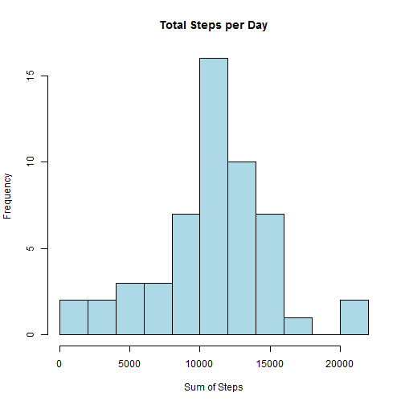
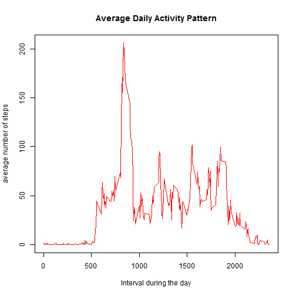
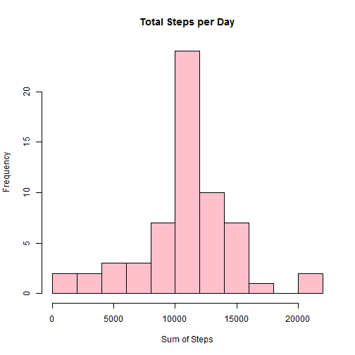
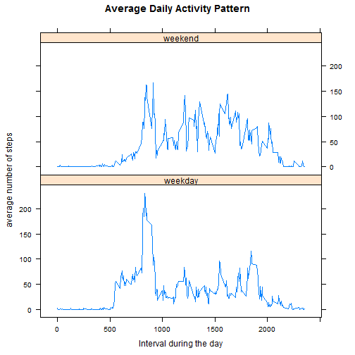

# Reproducible Research: Peer Assessment 1

This assignment uses activity monitoring data to answer the following questions.  The original dataset has the following columns:

- **steps**: Number of steps taken in a 5 minute interval (missing values are coded as NA.)
- **date**: The date on which the measurement was taken in YYYY-MM-DD format.
- **interval**: Identifier for the 5 minute interval in which the measurement was taken.

The dataset is stored in a CSV file with a total of 17,568 observations.

## Loading and preprocessing the data
Unzip and load the data into a dataframe.

```r
activityData <- read.csv(unz("activity.zip", "activity.csv"))
```
Add a column to the data that contains a character version of the interval.  For instance
5 becomes "0005", 110 becomes "0110."

```r
for (i in 1:length(activityData$interval))
  {h<-as.character(activityData$interval[i]%/%100)
   if (nchar(h)==1) h<-paste("0",h,sep="")
   m<-as.character(activityData$interval[i]%%100)
   if (nchar(m)==1) m<-paste("0",m,sep="")
   activityData$time[i]<-paste(h,m,sep="")
  }
```
Create another column that contains a datetime type using the columns date and the newly created time.

```r
activityData$DateTime<-paste(activityData$date,activityData$time,sep=" ")
activityData$DateTime<-as.POSIXlt(activityData$DateTime,format= "%Y-%m-%d %H%M",tz="GMT")
```
Note:  I use the packages **doBy** and **lattice** for this analysis.

```r
library(doBy)
library(lattice)
```
## What is mean total number of steps taken per day?  
To answer this question, create a table with the sum of steps for each day:

```r
stepsSummary<-summaryBy(steps ~ date, data = activityData, 
          FUN = list(sum))
```
Plot the histogram:

```r
hist(stepsSummary$steps.sum, breaks=10,main="Total Steps per Day", 
    xlab="Sum of Steps",col="light blue")
```

 

What are the mean and median of the totals? Here's the mean:

```r
mean(stepsSummary$steps.sum,na.rm=TRUE)
```

```
## [1] 10766.19
```
Here's the median:

```r
median(stepsSummary$steps.sum,na.rm=TRUE)
```

```
## [1] 10765
```

## What is the average daily activity pattern?

To answer this question, first build a table of the means for each interval:


```r
stepsbyinterval<-summaryBy(steps ~ time, data = activityData, 
                        FUN = list(mean),na.rm=TRUE)
```
Let's take a look at the values:

```r
plot(stepsbyinterval$time,stepsbyinterval$steps.mean,type="l",
     main="Average Daily Activity Pattern",xlab="Interval during the day",
     ylab="average number of steps", col="red")
```

 

As you can see, there is a definite spike of the number of steps during the day. What exactly is the maximum?

```r
max(stepsbyinterval$steps.mean)
```

```
## [1] 206.1698
```
When does it occur?

```r
stepsbyinterval$time[stepsbyinterval$steps.mean == max(stepsbyinterval$steps.mean)]
```

```
## [1] "0835"
```
## Imputing missing values

```r
nna<-length(activityData$steps[is.na(activityData$steps)])
```
A number of the values in the original data contain N/A, 2304 to be exact.  I have chosen to fill those values with the average number of steps for that interval taken over all days.  The results are stored in a new column:

```r
for (i in 1:length(activityData$steps))
  { 
   if (is.na(activityData$steps[i])) 
       activityData$stepsnew[i]<-
     stepsbyinterval$steps.mean[stepsbyinterval$time == activityData$time[i]]
   else activityData$stepsnew[i]<-activityData$steps[i]
  }
```
Let's take a look at the data with the filled in values.  First create a table with the sums of steps per day:

```r
stepsNewSummary<-summaryBy(stepsnew ~ date, data = activityData, 
                        FUN = list(sum))
```
Here's what the new data looks like:

```r
hist(stepsNewSummary$stepsnew.sum, breaks=10,main="Total Steps per Day", 
     xlab="Sum of Steps",col="pink")
```

 

It has a similar shape to the original with a the center a bit exagerated. 

Here's the new mean:

```r
mean(stepsNewSummary$stepsnew.sum)
```

```
## [1] 10766.19
```
And here's the new median:

```r
median(stepsNewSummary$stepsnew.sum)
```

```
## [1] 10766.19
```
The new values are very similar to the original data.  The impact has been minimal. One change is now the mean and the median are exactly the same.

## Are there differences in activity patterns between weekdays and weekends?

To answer this question, creat a new column containing the factor "weekend" or "weekday":

```r
for (i in 1:length(activityData$DateTime))
{ 
  if (substr(weekdays(activityData$DateTime[i]),1,1) == "S")
    activityData$daytype[i]<-"weekend"
  else activityData$daytype[i]<-"weekday"
}
activityData$daytype<-as.factor(activityData$daytype)
```
Let's take a look at the averages for each weekend day and weekday. 
First create a table of the averages breaking them down by day type:

```r
stepsbyintday<-aggregate(activityData$stepsnew, 
                         list(xinterval=activityData$interval,xdaytype=activityData$daytype), 
                         mean)
```
Here's the plot:

```r
xyplot(x~xinterval|xdaytype, data=stepsbyintday, type="l", layout=c(1,2), 
       main="Average Daily Activity Pattern",xlab="Interval during the day",
       ylab="average number of steps")
```

 

The plot does show a difference in the patterns.  The steps start to climb a little later in the day on the weekends and tend to stay higher during the bulk of the day.  
